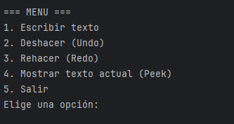
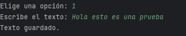
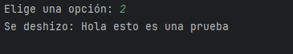
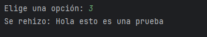
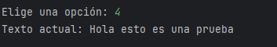

# Proyecto: Implementación de Pila en Java (Undo/Redo)

## 🎯 Objetivo del proyecto
El objetivo de este proyecto es implementar una estructura de datos **Pila (Stack)** en Java utilizando **genéricos** y emplearla en un programa de consola que permita simular las operaciones de:
- Escribir texto.
- Deshacer (**Undo**).
- Rehacer (**Redo**).
- Visualizar el texto actual.

De esta forma, se refuerza el aprendizaje de estructuras de datos lineales, nodos enlazados y el uso práctico de pilas en aplicaciones reales.

---

## ▶️ Instrucciones de ejecución

1. Clonar este repositorio o descargar los archivos.
   ```bash
   git clone https://github.com/tu_usuario/pilas-1.git

2. Abrir el proyecto en un IDE como IntelliJ IDEA, Eclipse o compilar desde consola.
3. Clonar este repositorio o descargar los archivos.
   ```bash
   javac src/Main.java 
3. Ejecutar el programa:
   ```bash
   java Main

## 🖼️ Capturas de pantalla de la ejecución

A continuación, se muestran ejemplos de la ejecución del programa en consola:

### 1. Menú principal


### 2. Escribir texto
El usuario escribe un texto y se guarda en la pila principal.



### 3. Deshacer acción (Undo)
El texto más reciente se elimina de la pila principal y pasa a la pila secundaria.



### 4. Rehacer acción (Redo)
El texto eliminado vuelve a la pila principal desde la secundaria.



### 5. Mostrar texto actual (Peek)
Se muestra el último texto ingresado en la pila.




## 👥 Contribuyentes

Este proyecto fue desarrollado por el grupo:

- Jhon Eduard Campo – [@Jhon](https://github.com/Jhoncampo)
- Luisa Fernanda Gaviria – [@Luisa](https://github.com/luisa-gaviria00)
- Anderson David Mejia – [@Ander](https://github.com/ander8824425-boop)

